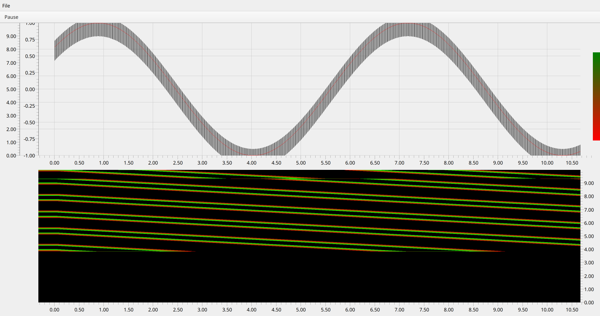

# ChartQt

ChartQt is a charting library written in C++ focusing on performance. It uses the Qt libraries but
has a dedicated rendering system running on top of QtQuick which gives it great performance and
a wide platform support, being able to use any of the 3D rendering APIs OpenGL, Vulkan, Direct3D and Metal.

## Building

ChartQt can be built like any other CMake-based project:

    $ git clone https://github.com/fair-acc/chart-qt.git
    $ cd chart-qt
    $ mkdir build
    $ cd build
    $ cmake ..
    $ cmake --build .

## Usage

ChartQt is written in C++ but it can also be used by a QML application:

    import QtQuick.Controls 2.3
    import ChartQt 1.0
    import QtQuick 2.0

    ApplicationWindow {
        visible: true
        width: 1980
        height: 450

        menuBar: MenuBar {
            Menu {
                title: qsTr("File")
                Action {
                    text: "foo"
                }
            }
        }

        header: ToolBar {
            ToolButton {
                text: chart.paused ? "Resume" : "Pause"
                onClicked: chart.paused = !chart.paused
            }
        }

        SinDataSet
        {
            id: sinDataSet
        }

        ChartLayout {
            anchors.top: parent.top
            anchors.left: parent.left
            anchors.right: parent.right
            anchors.bottom: parent.bottom
            orientation: Qt.Vertical

            ChartItem {
                id: chart
                clip: true

                DefaultZoomHandler {}

                XYPlot {
                    id: xy
                    xAxis: bottomAxis
                    yAxis: leftAxis
                    dataSet: sinDataSet
                }

                Axis {
                    id: bottomAxis
                    position: Axis.Bottom
                    max: 10
                }

                Axis {
                    id: leftAxis
                    position: Axis.Left
                    min: -1
                    max: 1
                }

                Axis {
                    id: leftAxis1
                    position: Axis.Left
                    min: 0
                    max: 10
                }

                MouseArea {
                    id: topHandle
                    width: 20
                    height: 10
                    anchors.right: parent.right
                    y: parent.height * 0.2 - height / 2
                    cursorShape: Qt.SizeVerCursor

                    property real pressY
                    onPressed: (mouse) => pressY = mouse.y
                    onPositionChanged: (mouse) => {
                        y += mouse.y - pressY
                    }
                }

                MouseArea {
                    id: bottomHandle
                    width: 20
                    anchors.right: parent.right
                    cursorShape: Qt.SizeVerCursor
                    y: parent.height * 0.8 - height / 2
                    height: 10

                    property real pressY
                    onPressed: (mouse) => pressY = mouse.y
                    onPositionChanged: (mouse) => {
                        y += mouse.y - pressY
                    }
                }

                Rectangle {
                    anchors.right: parent.right
                    width: 20
                    anchors.top: topHandle.verticalCenter
                    anchors.bottom: bottomHandle.verticalCenter

                    gradient: Gradient {
                        GradientStop { position: 0.0; color: "green" }
                        GradientStop { position: 1.0; color: "red" }
                    }
                }
            }
            ChartItem {
                id: waterfall

                Component.onCompleted: waterfall.addAxis(bottomAxis)
                    Axis {
                    position: Axis.Right
                    min: 0
                    max: 10
                }

                WaterfallPlot {
                    id: wf

                    gradientStart: 1 - (bottomHandle.y + bottomHandle.height / 2) / chart.height
                    gradientStop: 1 - (topHandle.y + topHandle.height / 2) / chart.height

                    xAxis: bottomAxis
                    dataSet: sinDataSet
                }
            }
        }
    }

This code will produce this output:

